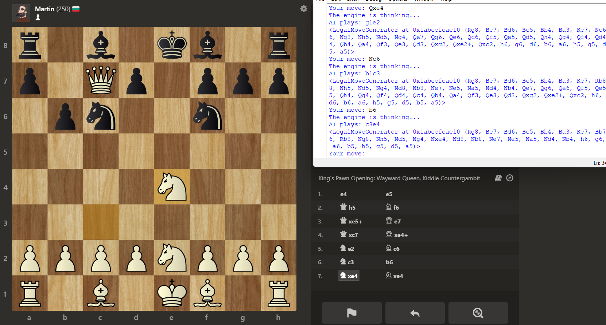
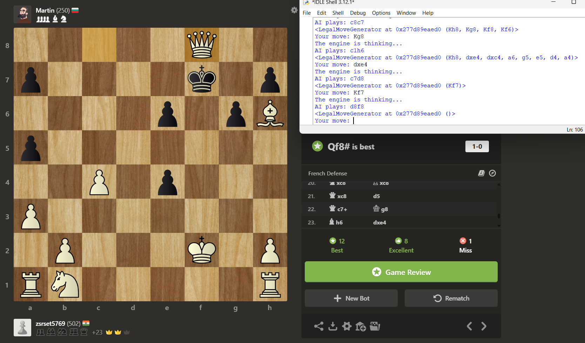
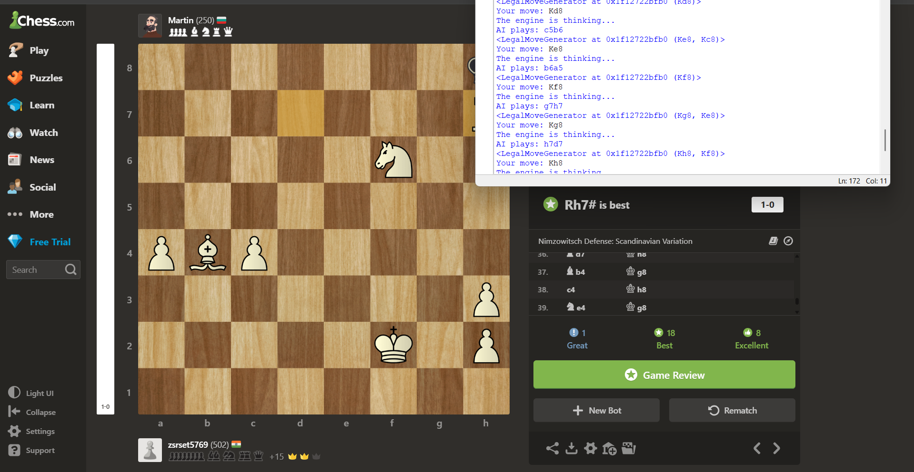

## ♟️ AI-Powered Chess Engine

A Python-based chess engine that plays strategically using the Minimax algorithm with optional Alpha-Beta pruning for efficiency. The engine evaluates moves multiple steps ahead and adapts difficulty through adjustable search depth.

## 🚀 Features

Minimax Algorithm – explores possible game states to select optimal moves.

Alpha-Beta Pruning – reduces unnecessary calculations for faster performance.

Adjustable Difficulty – set search depth to match beginner, intermediate, or advanced play.

Board Evaluation – scores positions to guide decision-making.

Interactive Gameplay – play directly via command-line interface.

## 🛠️ Tech Stack

Language: Python

Libraries: python-chess

Algorithms: Minimax, Alpha-Beta Pruning, Quiescence search

## 📸 Screenshots

### 1. Game Start

### 2. Checkmate in game 1

### 3. Checkmate in game 2

